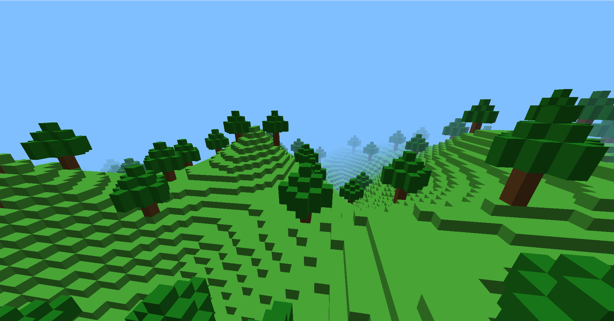
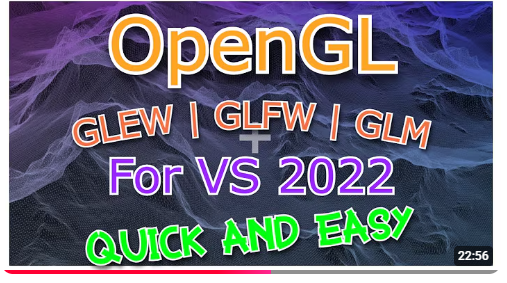

# Minecraft Clone - Procedural World Generation

A Minecraft-inspired voxel world renderer built from scratch in **C++ using OpenGL**.

This project is focused on learning and implementing the mathematics and graphics programming techniques behind a 3D voxel game. It includes procedural terrain generation, chunk-based world generation, custom camera mathematics, block types, trees, lighting, fog, collision detection, and a custom math library.

The project is built using OpenGL with GLFW and GLEW and is currently developed using Visual Studio on Windows.

---

## Screenshots

### Procedurally Generated World


### Terrain and Trees


### Fog / View Distance



<!-- Add additional screenshots as more features are implemented. -->

---

## Features

- Procedurally generated voxel terrain
- Chunk-based world generation
- Multiple block types
  - Stone
  - Wood
  - Grass
  - Dirt
  - Leaves
  - Water
  - Sand
- Procedurally generated trees
- First-person camera movement
- Mouse-controlled yaw and pitch
- Custom view matrix implementation
- Custom perspective projection matrix
- Custom vector and matrix math library
- Face-based block shading
- Directional diffuse lighting
- Ambient lighting
- Distance fog
- GLSL vertex and fragment shaders
- Smooth terrain generation using interpolated noise

---

## Technologies

- **C++**
- **OpenGL**
- **GLFW**
- **GLEW**
- **GLSL**
- **Visual Studio**

A small custom mathematics library is included in the project for the vector and matrix operations used by the renderer instead of relying entirely on an external math library.

---

## World Generation

The terrain is procedurally generated using a deterministic noise function.

Noise values are sampled at lattice points and smoothly combined using bilinear interpolation. The resulting values are used to determine terrain heights throughout the world.

The world is divided into chunks so that terrain can be organized and generated in sections.

Trees are also procedurally placed throughout the generated terrain.

---

## Graphics

The rendering system uses a custom OpenGL pipeline with GLSL vertex and fragment shaders.

The vertex shader handles transformations between model, world, view, and clip space.

The fragment shader handles:

- Block coloring
- Face-dependent brightness
- Directional diffuse lighting
- Ambient lighting
- Distance-based fog

Different block types are passed to the shader so that their final colors can be determined during rendering.

---

## Camera

The project implements a first-person 3D camera using custom vector mathematics.

Camera orientation is controlled using **yaw** and **pitch** angles.

From these angles, the camera's front vector is calculated and used to construct an orthonormal camera basis consisting of:

- Front
- Right
- Up

These vectors are then used to construct the view matrix and control movement through the world.

### Controls

| Key | Action |
| --- | --- |
| W | Move forward |
| S | Move backward |
| A | Move left |
| D | Move right |
| Mouse | Look around |

<!-- Add additional controls here if needed. -->

---

## Custom Math Library

The project contains a small custom math library (`gamemath.hpp`) created for the mathematics used by the renderer.

It currently includes:

- `vec3`
- `vec4`
- `mat4`
- Vector addition and subtraction
- Scalar multiplication
- Dot product
- Cross product
- Vector normalization
- Degree-to-radian conversion
- Perspective projection matrix construction
- Look-at/view matrix construction
- Matrix/vector operations

Implementing these operations manually was useful for understanding the mathematics behind the OpenGL transformation pipeline rather than treating the operations as a black box.

---

## Building the Project

### Requirements

To build the project you will need:

- Visual Studio with C++ development tools
- OpenGL
- GLFW
- GLEW

### GLFW / GLEW / OpenGL Setup

The libraries must be correctly included and linked with the Visual Studio project before compiling.

I recommend following the setup video below if you are unfamiliar with configuring GLFW, GLEW, and OpenGL in Visual Studio. The video also includes a setup for glm, which is not required for running the game because the project already has its own small game library

### Setup Tutorial

[](https://www.youtube.com/watch?v=i2-ASsa8wgo&t=746s)

The tutorial covers configuring the required include directories, library directories, and linker dependencies.

After the libraries are configured, clone the repository and open:

```text
openglProject.sln
```

in Visual Studio.

Build and run the project using the **x64** configuration.

---

## Project Structure

```text
minecraft-clone-world-generation/
│
├── openglProject/
│   ├── Minecraft.cpp
│   ├── gamemath.hpp
│   ├── minecraft.shader
│   ├── glm/
│   ├── glew32.dll
│   ├── openglProject.vcxproj
│   └── openglProject.vcxproj.filters
│
├── .gitignore
├── .gitattributes
├── openglProject.sln
└── README.md
```

### Important Files

**`Minecraft.cpp`**

Contains the main game and rendering logic, including world generation, terrain generation, camera movement, chunk handling, and rendering.

**`gamemath.hpp`**

Custom mathematics library containing vector and matrix types and operations used by the renderer.

**`minecraft.shader`**

Contains the GLSL vertex and fragment shaders used for rendering the world.

---

## Purpose of the Project

This project was created primarily as a way to learn the mathematics and low-level graphics concepts behind a voxel game.

Rather than relying entirely on existing abstractions, many systems were implemented manually to better understand concepts such as:

- Vector mathematics
- Dot and cross products
- Coordinate systems
- Camera orientation
- View matrices
- Perspective projection
- Model transformations
- Shader programming
- Procedural noise
- Bilinear interpolation
- Chunk-based world representation
- Real-time rendering

---

## Current Status

The project is actively being developed.

Current work is focused on expanding the world generation and adding additional gameplay and rendering features.

---

## Future Improvements

Possible future additions include:

- Block placement and destruction
- Improved terrain generation
- Additional biomes
- Additional block types
- Improved water rendering
- Texture mapping
- Texture atlas support
- Improved chunk loading and unloading
- Rendering optimizations
- Additional procedural structures
- Improved collision and player physics

---

## Author

Created by **Fortune0x0** as a C++/OpenGL graphics programming project.
